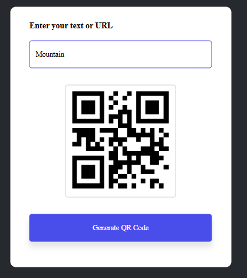

# QR Code Generator

A simple web-based QR Code Generator that converts text or URLs into QR codes instantly.

## 🚀 Features
- Generate QR codes instantly
- Supports text and URLs
- Simple and clean UI
- Built using pure JavaScript

## 🛠️ Tech Stack
- HTML
- CSS
- JavaScript
- QR Server API

## 📸 Demo
Enter any text or link and generate a QR code instantly.

## 📂 How to Run
1. Clone the repository
2. Open `index.html` in your browser

## 🎯 Purpose
A small practice project created for learning and experimentation.

---

⭐ Feel free to fork or improve!